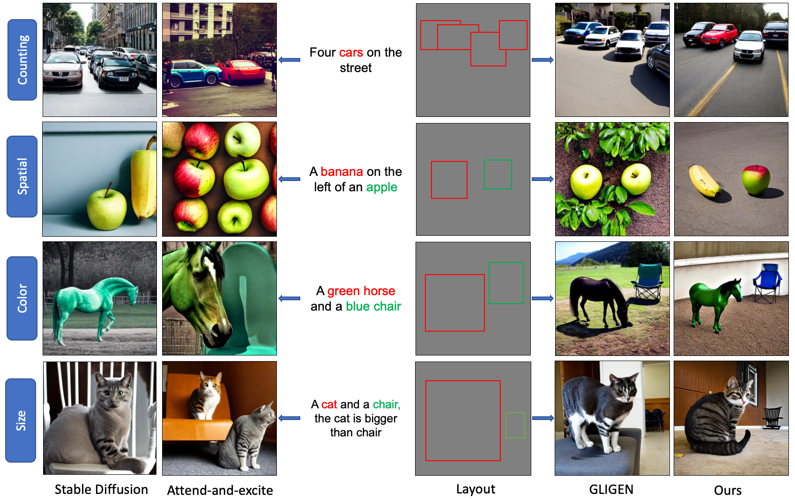

# Attention-refocusing: Grounded Text-to-Image Synthesis with Attention-based Guidance
[Quynh Phung](https://qqphung.github.io/), [Songwei Ge](https://mingukkang.github.io), [Jia-bin Huang](https://jbhuang0604.github.io), Universit of Maryland, College Park

[Project Page](https://attention-refocusing.github.io/AttentionRefocusing/)
[[Paper]()]
This is the official implementation of the paper "Grounded Text-to-Image Synthesis with Attention-based Guidance"


## Requirements
```bash
conda create --name ldm_layout python==3.8.0
conda activate ldm_layout
conda install pytorch torchvision torchaudio pytorch-cuda=11.7 -c pytorch -c nvidia
pip install -r requirements.txt
pip install git+https://github.com/CompVis/taming-transformers.git
pip install git+https://github.com/openai/CLIP.git
```
## Inference 
Download the model [GLIGEN](https://huggingface.co/gligen/gligen-generation-text-box/blob/main/diffusion_pytorch_model.bin) and put them in `gligen_checkpoints`, then run :
```
cd GLIGEN
python guide_gligen.py --ckpt [model_checkpoint]  --file_save [save_path] \
--type [category] --box_pickle [saved_boxes] [--use_gpt4]
```
Where
```
model_checkpoint: path to checkpoint of GLIGEN
save_path: the folder ot save images
category: the categories: counting, spatial, color, size
saved_boxes: the path to the generated layout from chatGPT
--use_gpt4: whether using GPT4 to generate layout.
If use GPT4, set your gpt4 api key
export OPENAI_API_KEY='your-api-key'
```
For instance:
```bash
cd GLIGEN
python guide_gligen.py --ckpt gligen_checkpoints/diffusion_pytorch_model.bin --file_save counting_500 \
--type counting --box_pickle ../data_evaluate_LLM/gpt_generated_box/counting.p
```

we provide generated layout from GPT4 for HRS benchmark in the  [HRS boxes](data_evaluate_LLM/gpt_generated_box), [DrawBench boxes](data_evaluate_LLM/gpt_generated_box_drawbench)  
We also provide generated images from GLIGEN, and other baselines including Stable Diffusion, Attend-and-excite, MultiDiffusion, Layout-guidance, GLIGEN and ours [here](https://drive.google.com/drive/folders/1t9LNoVppVsJG9B2LcvXF-4GMVXucbvlS?usp=sharing)

## Evaluation
Set up the environment, download detector models, and run evaluation for each category, see the [evaluation](data_evaluate_LLM/eval_metrics/README.md)


