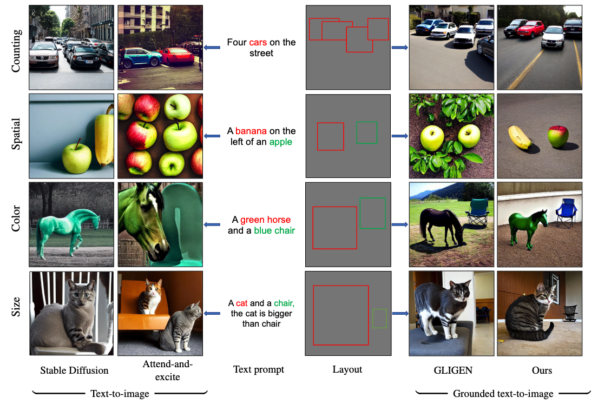

# Grounded Text-to-Image Synthesis with Attention Refocusing

[[Websit](https://attention-refocusing.github.io)]
[[Paper]()]
This is the official implementation of the paper "Grounded Text-to-Image Synthesis with Attention Refocusing"


https://github.com/Attention-Refocusing/attention-refocusing/assets/135548632/23195e0c-b7f9-4abb-8903-f3601a5a2590


## Requirements
```bash
conda create --name ldm_layout python==3.8.0
conda activate ldm_layout
conda install pytorch torchvision torchaudio pytorch-cuda=11.7 -c pytorch -c nvidia
pip install -r requirements.txt
pip install git+https://github.com/CompVis/taming-transformers.git
pip install git+https://github.com/openai/CLIP.git
```
## Inference 



Download the model [GLIGEN](https://huggingface.co/gligen/gligen-generation-text-box/blob/main/diffusion_pytorch_model.bin) and put them in `gligen_checkpoints`


Run with the prompts in HRS/Drawbench prompts :
```
python guide_gligen.py --ckpt [model_checkpoint]  --file_save [save_path] \
--type [category] --box_pickle [saved_boxes] [--use_gpt4]
```
Where

<!-- ```--ckpt``` : path to checkpoint of GLIGEN
save_path: the folder ot save images
category: the categories: counting, spatial, color, size
saved_boxes: the path to the generated layout from chatGPT
--use_gpt4: whether using GPT4 to generate layout.
If use GPT4, set your gpt4 api key
export OPENAI_API_KEY='your-api-key' -->

- `--ckpt`: Path to checkpoint of GLIGEN
- `--file_save`: The folder to save images
- `--type`: The categories (options include counting, spatial, color, size)
- `--box_pickle`: The path to the generated layout from ChatGPT
- `--use_gpt4`: Whether to use GPT-4 to generate the layout. If you're using GPT-4, set your GPT-4 API key as follows:
```bash
export OPENAI_API_KEY='your-api-key'
```
For instance:
```bash
cd GLIGEN
python guide_gligen.py --ckpt gligen_checkpoints/diffusion_pytorch_model.bin --file_save counting_500 \
--type counting --box_pickle ../data_evaluate_LLM/gpt_generated_box/counting.p
```
Run with users' provided text prompts:
```bash
export OPENAI_API_KEY='your-api-key'
python inference.py
```
we provide generated layout from GPT4 for HRS benchmark in the  [HRS boxes](data_evaluate_LLM/gpt_generated_box), [DrawBench boxes](data_evaluate_LLM/gpt_generated_box_drawbench)  
We also provide generated images from GLIGEN, and other baselines including Stable Diffusion, Attend-and-excite, MultiDiffusion, Layout-guidance, GLIGEN and ours [here](https://drive.google.com/drive/folders/1t9LNoVppVsJG9B2LcvXF-4GMVXucbvlS?usp=sharing)

## Evaluation
Set up the environment, download detector models, and run evaluation for each category, see the [evaluation](data_evaluate_LLM/eval_metrics/README.md)
<!-- ## Acknowledgments
Our code is built upon the [GLIGEN](https://github.com/gligen/GLIGEN). The evaluation part from the [HRS](https://github.com/eslambakr/HRS_benchmark) -->
## Acknowledgments

This project would not have been possible without the use of the following resources:

- [**GLIGEN**](https://github.com/gligen/GLIGEN): Our code is built upon the foundational work provided by GLIGEN. 

- [**HRS**](https://github.com/eslambakr/HRS_benchmark): The evaluation component of our project has been adopted from HRS. 

We want to express our sincere gratitude to all those who have contributed to these resources. Your work has significantly aided in making our project a success.


